# Architecture Diagram

This document contains detailed Mermaid diagrams visualizing the buddy application architecture.

## Overall Architecture

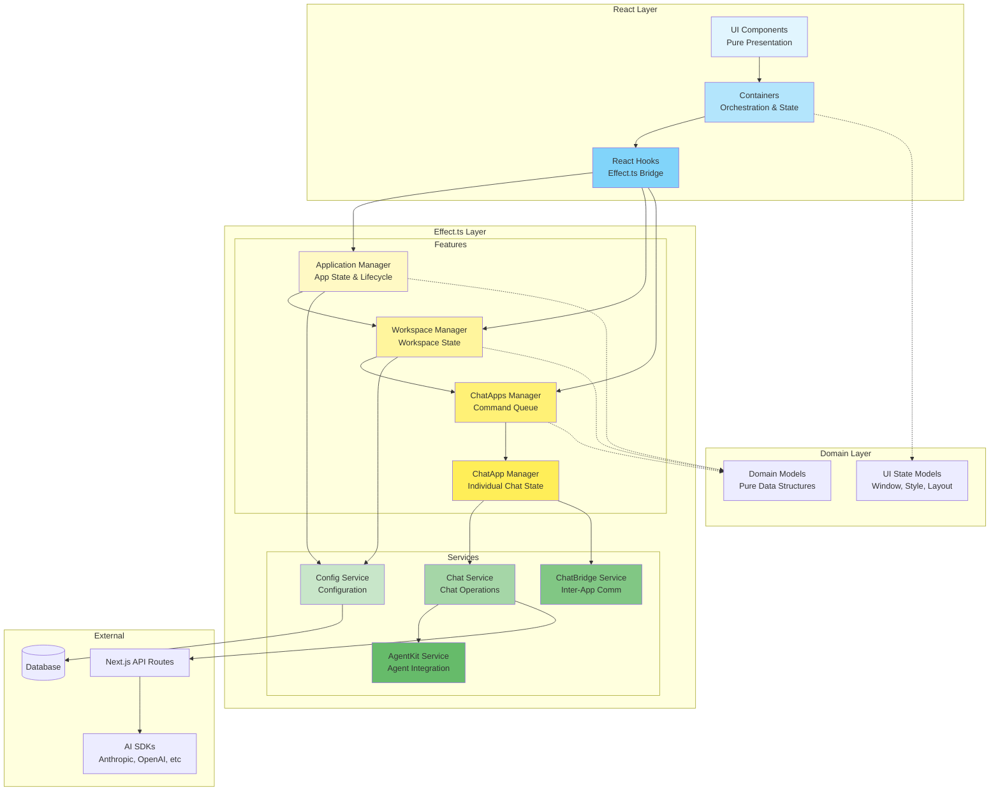

## Manager Pattern (MDX Structure)

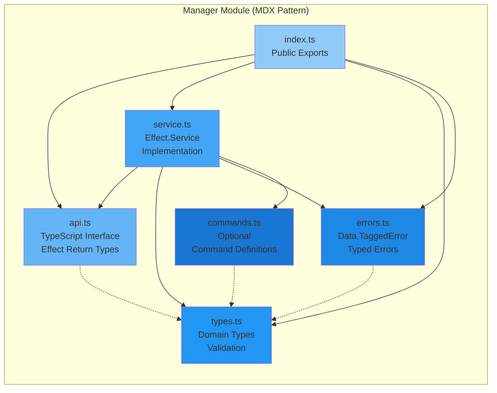

## Command-Driven Manager Flow

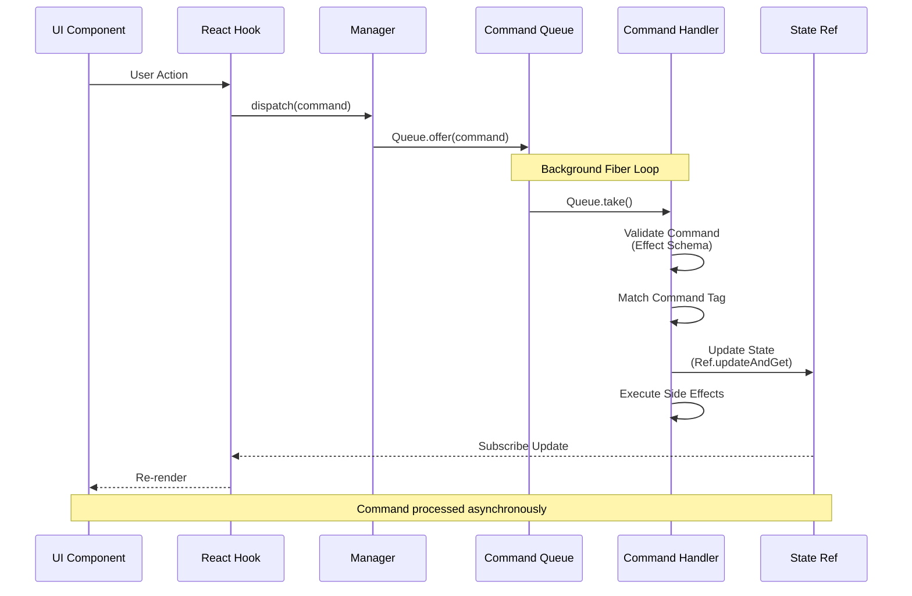

## Effect.ts Service Lifecycle

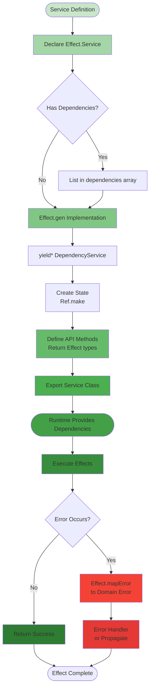

## React Integration Pattern

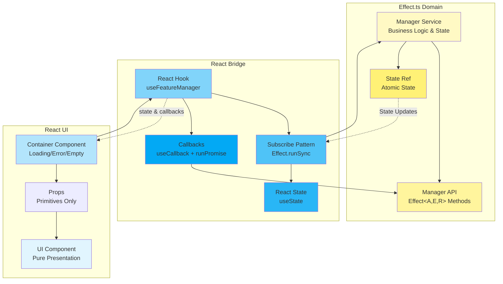

## Feature Folder Structure

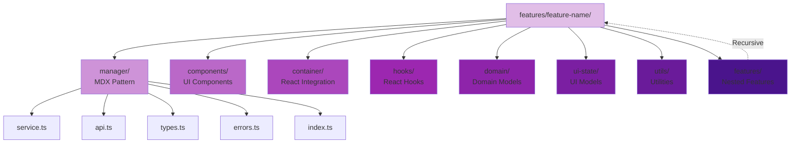

## Error Handling Flow

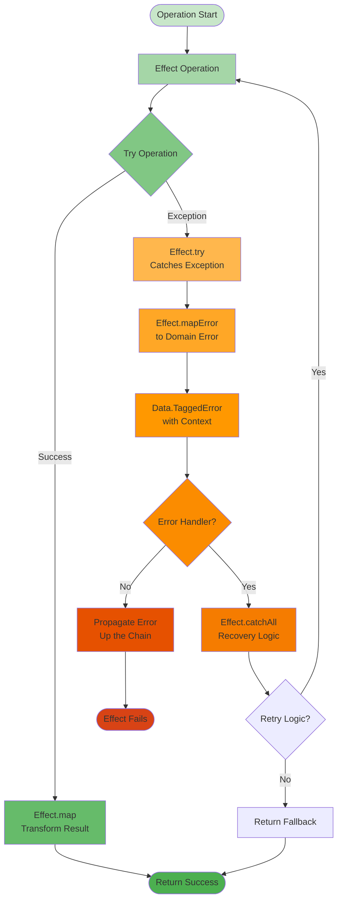

## Data Flow: User Action to UI Update

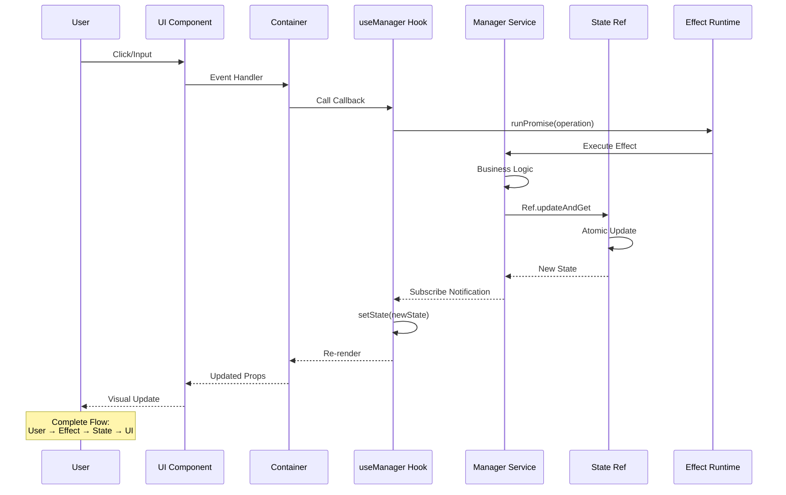

## Service vs Manager Decision Tree

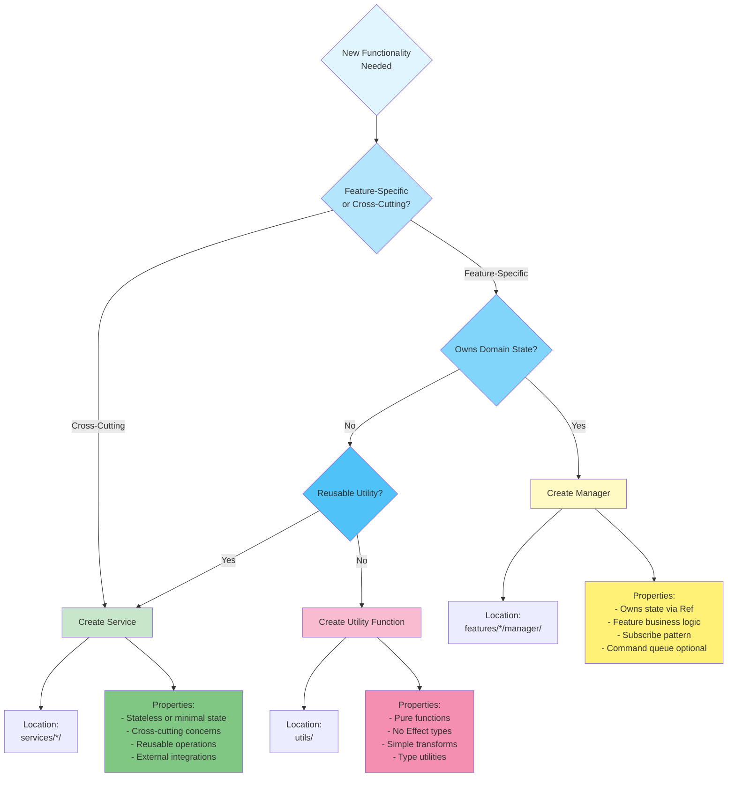

## Dependency Injection & Layer Composition

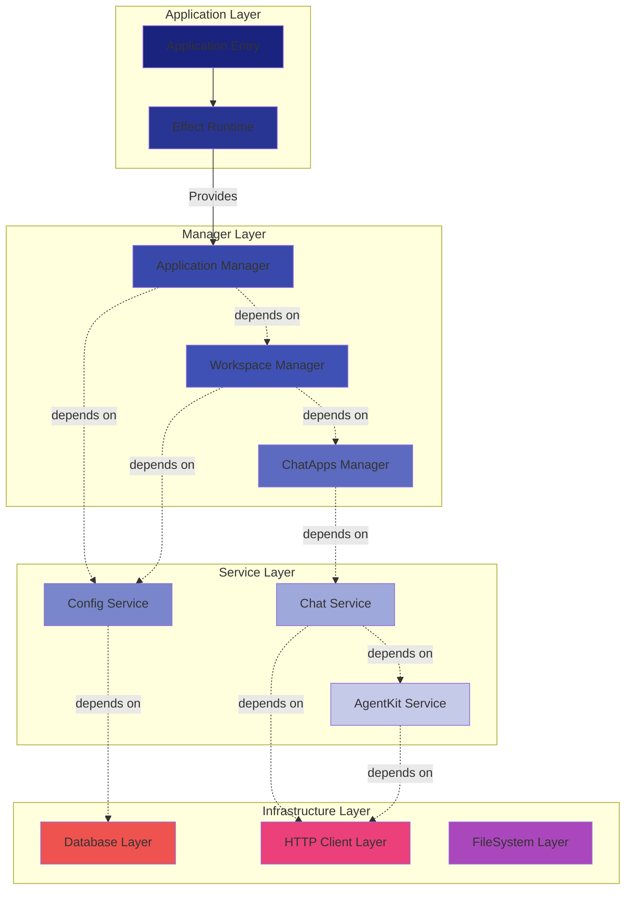

## Testing Architecture

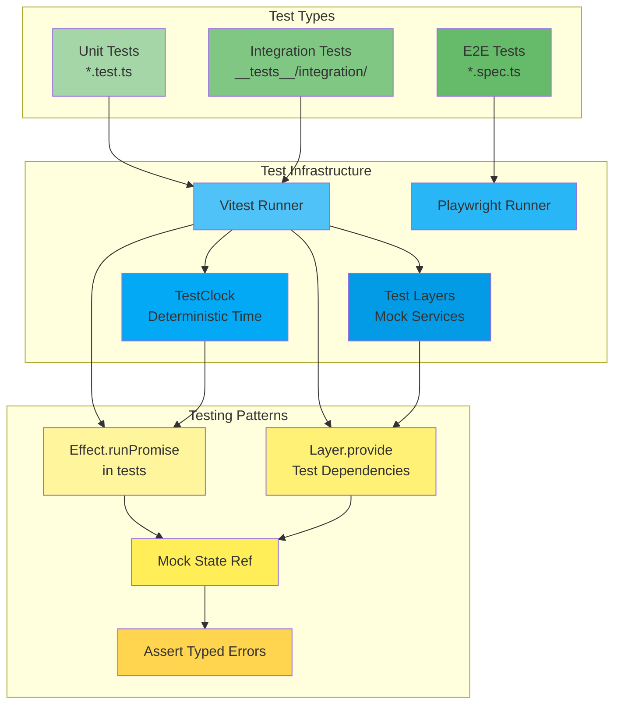

---

## Architecture Principles Summary

1. **Separation of Concerns**: React UI, Effect.ts business logic, pure domain models
2. **Unidirectional Data Flow**: User → Effect → State → UI
3. **Type Safety**: TypeScript + Effect types + Schema validation
4. **Dependency Injection**: Services declare dependencies, runtime provides
5. **Error Handling**: Typed errors throughout, no exceptions
6. **Testability**: Pure functions, mock layers, deterministic time
7. **Composability**: Effects compose, managers compose, services compose
8. **State Management**: Atomic updates via Ref, subscribe pattern for React
