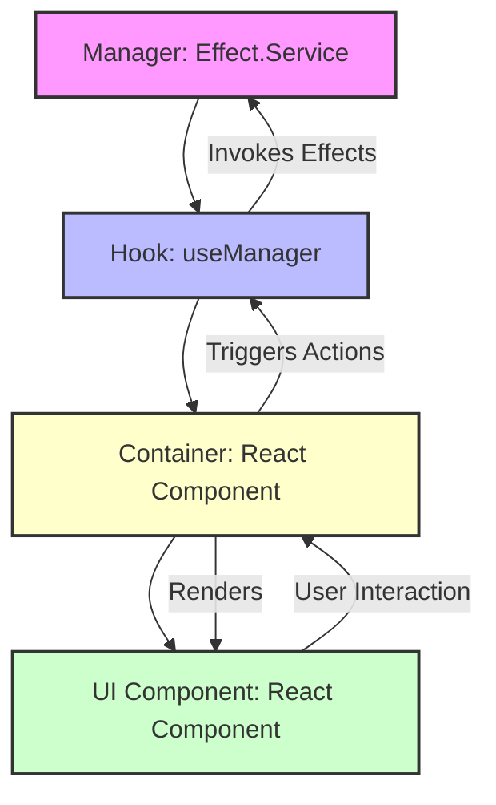
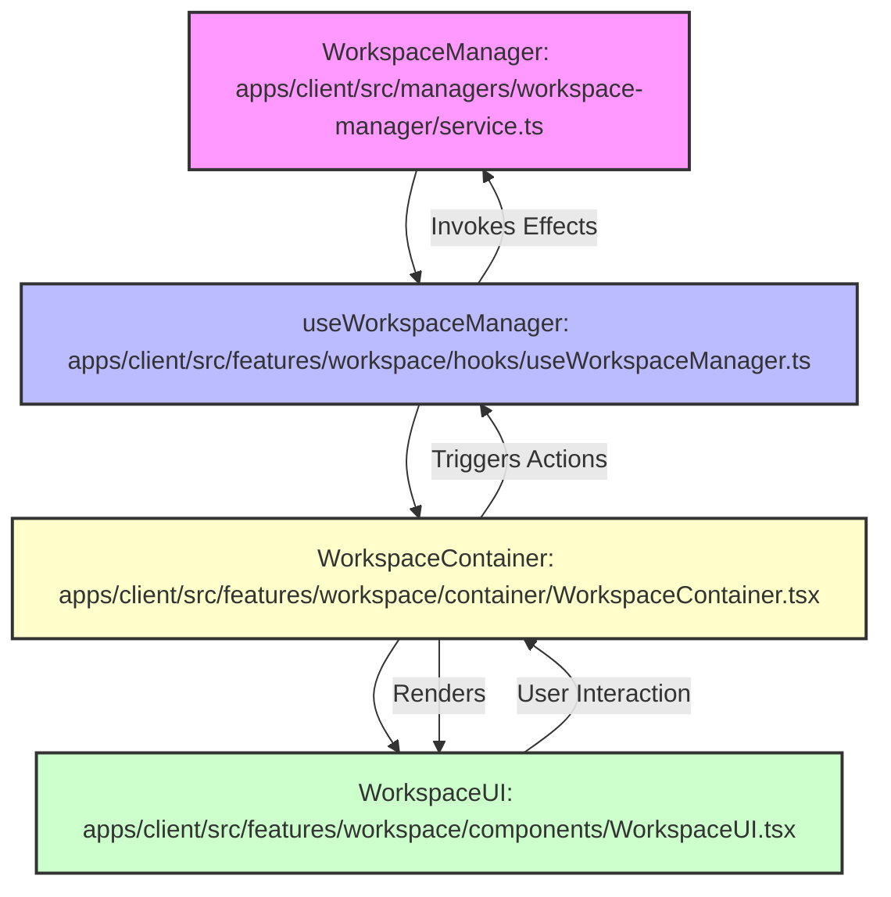

# Application Feature Architecture

This document describes the architectural pattern used for building features within this application. The core principle is a clear separation of concerns, where each feature is composed of distinct but interconnected layers: **Managers**, **Hooks**, **Containers**, and **UI Components**.

## Core Principles

1.  **Single Source of Truth for State**: Managers are the authoritative source for a feature's state.
2.  **Clear Boundaries**: Each layer has well-defined responsibilities, promoting modularity and maintainability.
3.  **Testability**: The separation allows for independent testing of each layer.
4.  **Scalability**: New features can be added by following this consistent pattern.

## Architectural Layers

### 1. Managers

**Purpose**: Managers are Effect.js services responsible for managing the state and business logic of a specific feature. They encapsulate complex operations, data fetching, and state transformations.

**Implementation**: Managers are implemented as `Effect.Service` adhering to the MDX service pattern, which includes `api.ts`, `errors.ts`, `types.ts`, `service.ts`, and `index.ts`. They expose their capabilities as `Effect` effects.

**Location**: `apps/client/src/managers/<feature-name>/` (though for some features, they might be in `apps/client/src/features/<feature-name>/managers/`)

### 2. Hooks

**Purpose**: Hooks provide a React-idiomatic way to access and interact with the state managed by a Manager. They subscribe to state changes and expose relevant data and actions to React components.

**Implementation**: Hooks typically wrap Manager services, using `Effect.runSync` or `Effect.runPromise` internally to bridge the Effect.js runtime with React's rendering cycle. They provide a stable API for consuming feature state within React components.

**Location**: `apps/client/src/features/<feature-name>/hooks/`

### 3. Containers

**Purpose**: Containers are React components that serve as the integration point for a specific feature. They are responsible for orchestrating the feature's logic by using Hooks to access Manager state and then rendering the appropriate UI Component.

**Implementation**: Containers typically import a feature's `use*Manager` hook and pass the retrieved state and actions down to the UI Component. They handle loading states, errors, and conditional rendering based on the feature's state.

**Location**: `apps/client/src/features/<feature-name>/container/`

### 4. UI Components

**Purpose**: UI Components are pure React components responsible for rendering the visual representation of a feature. They receive all necessary data and callback functions as props from their Container.

**Implementation**: UI Components should be "dumb" components, focusing solely on presentation. They avoid direct interaction with Managers or Hooks, promoting reusability and simplifying testing.

**Location**: `apps/client/src/features/<feature-name>/components/`

## Architecture Flow

This diagram illustrates the flow of data and control within a feature following this architectural pattern:

## Example: Workspace Feature

The Workspace feature exemplifies this pattern:

## Conclusion

This architectural pattern promotes a robust, scalable, and maintainable application by clearly defining the responsibilities of each layer and leveraging Effect.js for state management and functional purity. By adhering to these principles, we ensure consistency and facilitate collaborative development across the application. 