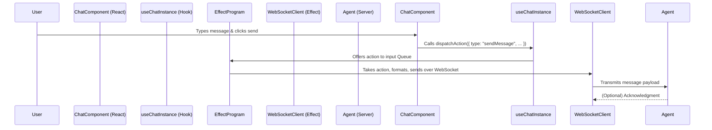
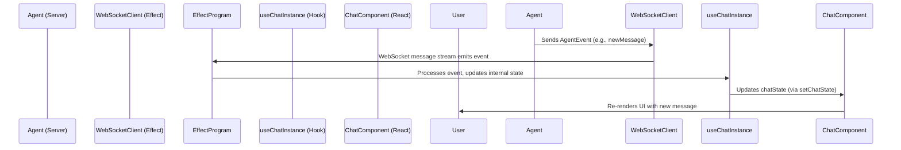

## Overview Architecture Document: Buddy Chat Instance Client

**Version:** 1.0
**Date:** 5/21/2025
**Author:** T3 Chat (Generated for Paul)

### 1. Introduction & Goals

This document outlines the client-side architecture for an individual chat instance within the "Buddy" application. Buddy is designed as a multi-chat application where users interact with various AI-powered "Agents" rather than directly with LLMs. Each chat interaction is intended to be an isolated, concurrent session.

**Goals of this Client-Side Architecture:**

*   **Isolation:** Each chat instance operates independently, without interfering with others.
*   **Concurrency:** Multiple chat instances can run simultaneously and efficiently.
*   **Resilience:** Chat instances should gracefully handle transient network issues, attempting to reconnect automatically.
*   **React Integration:** Seamlessly integrate with a React-based UI, providing a reactive experience.
*   **Resource Safety:** Ensure that resources, particularly WebSocket connections, are properly managed and released.
*   **Testability:** Design components and logic in a way that facilitates unit and integration testing.

### 2. Core Principles

The architecture is guided by the following principles:

*   **React for UI:** Leverage React for building the user interface components, managing local UI state, and handling user input events.
*   **Effect for Core Logic:** Utilize the Effect-TS ecosystem for managing complex asynchronous operations, state that outlives React components, side effects (like API calls), concurrency, and resource safety.
*   **Custom Hooks as the Bridge:** Employ React Custom Hooks (`useChatInstance`) to encapsulate the Effect-driven logic and provide a clean, reactive interface to the React UI components.
*   **WebSockets for Real-Time Communication:** Use WebSockets for persistent, bi-directional, real-time communication between the client (chat instance) and its designated Agent.
*   **Service-Oriented Design within Effect:** Structure Effect programs to depend on abstract services (e.g., `AgentConfig`, `WebSocketPlatform`), which are then provided by concrete implementations (Layers). This enhances modularity and testability.
*   **Type Safety:** Leverage TypeScript throughout the stack to ensure data integrity and reduce runtime errors.

### 3. Key Components & Responsibilities

The client-side architecture for a single chat instance comprises the following key components:

1.  **React UI Layer (`ChatComponent`):**
    *   Responsible for rendering the chat interface (message list, input field, status indicators).
    *   Captures user input (e.g., sending a message).
    *   Subscribes to state updates from the `useChatInstance` hook and re-renders accordingly.

2.  **Custom Hook (`useChatInstance`):**
    *   The central orchestrator for a single chat instance.
    *   Manages the lifecycle of the Effect program associated with the chat.
    *   Provides a reactive state (`chatState`) and action dispatcher (`dispatchAction`) to the `ChatComponent`.
    *   Bridges the declarative React world with the functional Effect world.

3.  **Effect Runtime & Program:**
    *   The core "engine" for a chat instance, managed by `useChatInstance`.
    *   Handles all business logic:
        *   Establishing and managing the WebSocket connection.
        *   Sending outgoing messages to the Agent.
        *   Processing incoming messages and events from the Agent.
        *   Managing internal state (e.g., connection status, message history, retry attempts).
        *   Implementing retry logic for WebSocket connections.
    *   Ensures resource safety using Effect's `Scope`.

4.  **Agent (Server-Side):**
    *   A server-side application (presumably also built with Effect or compatible technology).
    *   Exposes a WebSocket endpoint for each Agent type.
    *   Manages the Agent's internal state and business logic.
    *   Communicates with the client chat instance using a predefined message protocol.
    *   Identifies client sessions using `chatId` and `agentId`.

5.  **Shared Types (`common-types.ts`):**
    *   A TypeScript module defining the data structures (interfaces and types) used for communication between the client and agent, and for representing the chat state. This forms the "contract" for data exchange.

### 4. High-Level Interaction Flow

**A. User Sends a Message:**

**B. Agent Sends an Event (e.g., New Message):**

**C. Connection Lifecycle:**

1.  **Mount:** `ChatComponent` mounts -> `useChatInstance` initializes -> Effect program starts.
2.  **Connect:** Effect program attempts WebSocket connection (using `WebSocketPlatform`).
    *   **Success:** Status becomes "connected". Message flow enabled.
    *   **Failure:** Status becomes "reconnecting". Retry logic (defined by an Effect `Schedule`) activates.
3.  **Disconnect (Unexpected):** WebSocket drops.
    *   Effect program detects closure/error.
    *   Status becomes "reconnecting". Retry logic activates.
4.  **Unmount:** `ChatComponent` unmounts -> `useChatInstance` cleanup runs.
    *   Effect program is interrupted.
    *   Associated `Scope` is closed, ensuring WebSocket connection and other resources are released.

### 5. Technology Stack (Client-Side Focus)

*   **React:** For UI components and declarative rendering.
*   **Next.js:** (Assumed context) Provides the framework for the React application, routing, etc.
*   **Effect-TS (`@effect/io`, `@effect/platform`, `@effect/platform-browser`):** For managing side effects, asynchronous operations, state, concurrency, and resource safety.
    *   `Effect`: Core data type for describing computations.
    *   `Stream`: For handling sequences of asynchronous events (e.g., incoming WebSocket messages).
    *   `Queue`: For buffered communication between React and Effect.
    *   `Scope`: For resource management.
    *   `Layer`: For dependency injection.
    *   `Schedule`: For defining retry policies.
    *   `@effect/platform/WebSocket`: Abstraction for WebSocket communication.
    *   `@effect/platform-browser/WebSocketPlatform`: Browser-specific implementation.
*   **TypeScript:** For static typing and improved code quality.

### 6. Benefits of this Architecture

*   **Strong Guarantees:** Effect provides strong guarantees around error handling, resource management, and concurrency.
*   **Type Safety:** End-to-end type safety with TypeScript reduces runtime errors.
*   **Composability:** Effect programs are highly composable, allowing complex asynchronous logic to be built from smaller, manageable pieces.
*   **Excellent Testability:** Effect's built-in test kit, including `TestClock` and the ability to mock services via `Layer`s, facilitates thorough testing.
*   **Automatic Resource Management:** `Scope` ensures that resources like WebSocket connections are acquired and released safely, preventing leaks.
*   **Isolated Concurrency:** Each chat instance runs its Effect program in an isolated Fiber, preventing interference.
*   **Built-in Resilience:** Effect's `retry` combinator allows for declarative and robust retry mechanisms.
*   **Clear Separation of Concerns:** React handles the "what to render," while Effect handles the "how to do it" for complex backend interactions and state.
