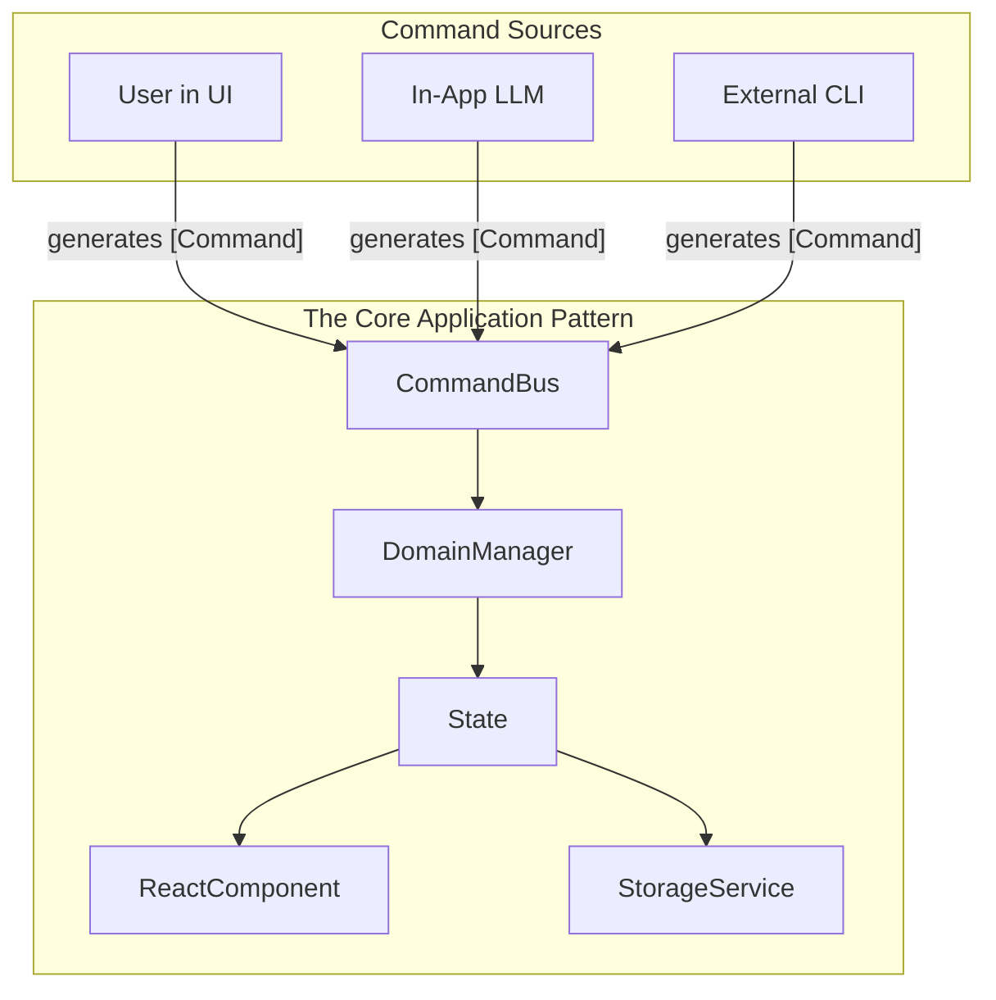

# Buddy Command-Driven Architecture

This document outlines the command-driven architecture for the Buddy application. This design was established to provide a clear, robust, and scalable model for handling application logic and state, particularly for the in-app experience.

## Core Concepts

The architecture is built on a few core concepts that work together in a unidirectional data flow.

1.  **Command Sources:** These are the initiators of any action in the system. They are responsible for creating a command object to represent an intent.
    *   User interactions within the UI.
    *   The in-app LLM agent.
    *   The external CLI.

2.  **Command Bus:** A central, in-memory queue that receives all command objects from any source. This ensures that commands are processed serially, in the order they were received, preventing race conditions.

3.  **Domain Manager:** A service dedicated to a specific business domain (e.g., `WorkspaceManager`, `AgentManager`).
    *   It is the "brain" for its domain.
    *   It subscribes to the Command Bus and processes only the commands relevant to it.
    *   It **owns and encapsulates** the state for its domain.
    *   It contains all business logic for mutating its state in response to commands.

4.  **State Subscribers (Renderers):** These are components that react to changes in a `DomainManager`'s state.
    *   **React Component:** A UI component that subscribes to the state and re-renders itself on the screen when the state changes.
    *   **Storage Service:** A persistence service that also subscribes to the state and "renders" it to a durable store (like `localStorage`) when the state changes.

## The Architectural Pattern

The core pattern is a reactive loop triggered by commands. The `DomainManager` is the heart of this loop, managing state and logic, while the `ReactComponent` and `StorageService` act as peer subscribers that are independently notified of state changes.

## Data Flow

1.  A **Command Source** (e.g., the User in the UI) creates a command object.
2.  The command is sent to the central **Command Bus**.
3.  The **Command Bus** routes the command to the appropriate **Domain Manager**.
4.  The **Domain Manager** executes its business logic, which results in an update to its internal **State**.
5.  The change in **State** notifies all of its subscribers simultaneously:
    *   The **React Component** re-renders to display the new state on the screen.
    *   The **Storage Service** saves the new state to `localStorage` for persistence.

This creates a clear separation of concerns and a robust, one-way data flow. The business logic is decoupled from the UI and persistence layers, which simply react to state changes. 