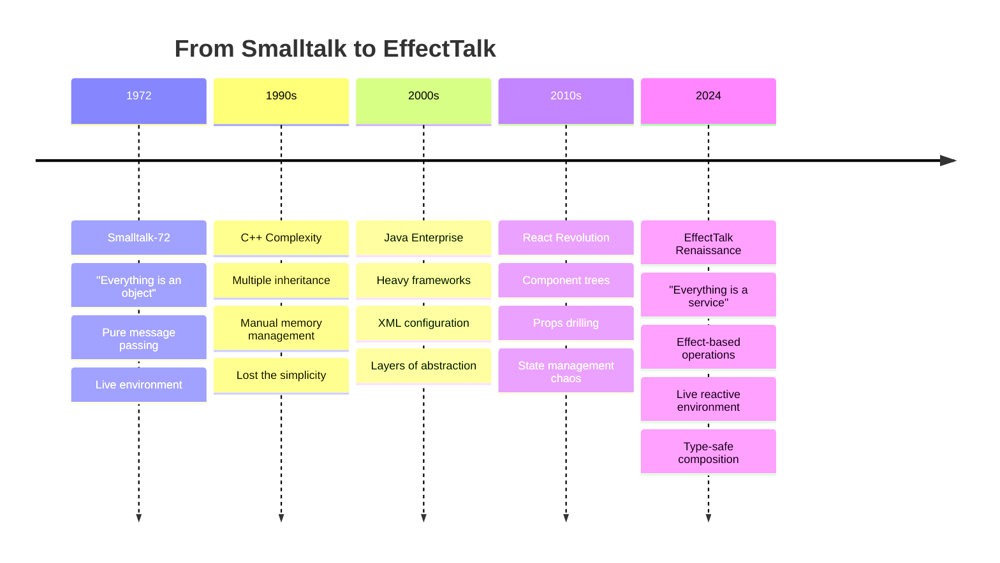

# EffectTalk: The Return to Smalltalk's Vision

> **"Everything is a Service"** - The evolution of Alan Kay's "Everything is an Object"

## The Lightbulb Moment 💡

After 50 years of software evolution, we've come full circle back to Smalltalk's original vision - but with modern tools and type safety. **EffectTalk** is the fusion of Smalltalk's philosophical purity with Effect-TS's functional power, creating a new architectural pattern that makes "English is the UI" a reality.

## What is EffectTalk?

**EffectTalk** is an architectural pattern that combines:
- **Smalltalk's Philosophy**: Everything is an object, message passing, live environment
- **Effect-TS Power**: Type safety, error handling, composable operations
- **Modern Tooling**: TypeScript, React, Bun, Next.js

The result is a system where services are the new objects, Effect operations are the new messages, and multiple interfaces (GUI, CLI, LLM) can interact with the same business logic.

## Core Principles

### 1. "Everything is a Service"
Just as Smalltalk said "Everything is an Object", EffectTalk says "Everything is a Service".

```typescript
// Smalltalk Object
Object subclass: #Workspace
  instanceVariableNames: 'name description apps'

// EffectTalk Service
export class WorkspaceManager extends Effect.Service<WorkspaceManagerApi>()(
  "WorkspaceManager",
  {
    scoped: Effect.gen(function* () {
      const stateRef = yield* Ref.make(initialState)
      // Service implementation
      return { /* operations */ }
    })
  }
) {}
```

### 2. "Services Communicate via Effect Operations"
Instead of Smalltalk's `object message: args`, we have `yield* service.operation(args)`.

```typescript
// Smalltalk message sending
workspace addApp: chatApp.
chatApp sendMessage: 'Hello world'.

// EffectTalk service operations
yield* workspaceManager.addChatAppToWorkspace(workspaceId, chatApp)
yield* chatManager.sendMessage('Hello world')
```

### 3. "State is Managed with Effect Refs"
Smalltalk's instance variables become Effect Refs - reactive, type-safe state.

```typescript
// Internal service state (like Smalltalk instance variables)
const stateRef = yield* Ref.make<WorkspaceManagerState>({
  currentWorkspaceId: null,
  workspaces: {},
  chatApps: {},
  isLoading: false
})

// Reactive updates notify all subscribers
const updateState = (updater) =>
  Effect.gen(function* () {
    yield* Ref.update(stateRef, updater)
    const newState = yield* Ref.get(stateRef)
    yield* notifyAllListeners(newState)
  })
```

### 4. "UIs are Just Thin Renderers"
React becomes like a TV screen - it just displays what the service tells it to display.

```typescript
// UI subscribes to service state
const WorkspaceManagerUI = () => {
  const [state, setState] = useState(null)
  
  useEffect(() => {
    const unsubscribe = workspaceManager.subscribe(setState)
    return unsubscribe
  }, [])
  
  // Just render state and send actions
  return <div onClick={() => workspaceManager.createWorkspace()}>
    {state.workspaces.map(ws => <div>{ws.name}</div>)}
  </div>
}
```

### 5. "English is the Ultimate UI"
Natural language becomes just another interface to the same services.

```typescript
// Same service, different interfaces
const service = WorkspaceManager

// GUI Interface
<button onClick={() => service.createWorkspace({name: "Writing"})}>
  Create Workspace
</button>

// CLI Interface  
$ buddy workspace create "Writing"

// LLM Interface
"Create a writing workspace" → service.createWorkspace({name: "Writing"})
```

## EffectTalk: Advanced Best Practices (2025 Update)

### Single Source of Truth and Canonical State
- Each manager (e.g., AgentManager, ChatAppsManager, WorkspaceManager) must be the canonical source for its entities.
- Cross-entity relationships are always by ID, never by value.
- UI and selectors fetch details from canonical maps, not from embedded/duplicated objects.
- This eliminates stale state, reduces bugs, and simplifies updates.

**Example:**
```typescript
// WorkspaceManager stores only chatAppIds, not full objects
const workspace = {
  id: "ws-1",
  chatAppIds: ["app-1", "app-2"]
}
// ChatAppsManager holds the canonical chat app objects
const chatApps = {
  "app-1": { ... },
  "app-2": { ... }
}
```

### Atomic State Updates with Ref.modify
- All multi-step state operations must use atomic `Ref.modify` to prevent race conditions.
- Never update state in multiple steps or outside a single atomic operation.

**Example:**
```typescript
const addAgent = (agent) =>
  Ref.modify(stateRef, (state) => {
    const newAgents = { ...state.agents, [agent.id]: agent };
    return [Effect.succeed(undefined), { ...state, agents: newAgents }];
  }).pipe(Effect.flatten);
```

### Standardized Subscription and Cleanup in Hooks
- All hooks that subscribe to services must:
  - Use `useRef` to store unsubscribe/cleanup functions.
  - Always clean up subscriptions on unmount or dependency change.
  - Log errors during cleanup.
  - Follow React's rules of hooks for safe resource management.
- Never rely on closure variables for cleanup; always use a stable ref.
- Rapid mount/unmount cycles must not cause leaks or duplicate listeners.

**Example:**
```typescript
const unsubscribeRef = useRef<(() => void) | null>(null);
useEffect(() => {
  // ... subscribe ...
  unsubscribeRef.current = unsubscribe;
  return () => {
    if (unsubscribeRef.current) unsubscribeRef.current();
  };
}, []);
```

### Service Layer Subscription API Requirements
- All service `.subscribe` methods must:
  - Return a robust unsubscribe function.
  - Remove listeners and clean up resources.
  - Be safe to call multiple times.
- Tests must verify that unsubscribing stops updates and that no memory leaks or duplicate listeners occur.

**Example:**
```typescript
const subscribe = (listener) => {
  listeners.add(listener);
  return () => listeners.delete(listener);
};
```

### Test Coverage for Resource Management
- All resource-managing hooks and services must have tests for:
  - State updates on mount.
  - Cleanup on unmount (no updates after unmount).
  - Rapid mount/unmount cycles.
  - Error handling during subscription.
- Selector and UI hooks may be tested for logic/UI correctness, but do not require resource management tests.

### Updated Anti-Patterns
- Never duplicate entity state across managers.
- Never update state outside atomic operations.
- Never use closure variables for resource cleanup in hooks.
- Never skip error handling or cleanup in tests.
- Never use raw promises or throw errors in Effect-based code.

## The Journey Back to Smalltalk



## EffectTalk vs Traditional Patterns

### Traditional React (Heavy Components)

```typescript
// ❌ Traditional React - Heavy, mixed concerns
const WorkspaceComponent = () => {
  const [workspaces, setWorkspaces] = useState([])
  const [loading, setLoading] = useState(false)
  const [error, setError] = useState(null)
  
  // Business logic mixed with UI
  const createWorkspace = async (name) => {
    if (!name.trim()) {
      setError("Name required")
      return
    }
    
    setLoading(true)
    try {
      const response = await fetch('/api/workspace', {
        method: 'POST',
        body: JSON.stringify({ name })
      })
      
      if (!response.ok) throw new Error('Failed')
      
      const workspace = await response.json()
      setWorkspaces(prev => [...prev, workspace])
    } catch (err) {
      setError(err.message)
    } finally {
      setLoading(false)
    }
  }
  
  // Complex UI with business logic
  return <div>Heavy component with mixed concerns</div>
}
```

### EffectTalk Pattern (Clean Separation)

```typescript
// ✅ EffectTalk Service - Pure business logic
export class WorkspaceManager extends Effect.Service<WorkspaceManagerApi>()(
  "WorkspaceManager",
  {
    scoped: Effect.gen(function* () {
      const stateRef = yield* Ref.make(initialState)
      const listenersRef = yield* Ref.make(new Set())
      
      const createWorkspace = (params) =>
        Effect.gen(function* () {
          // Validation
          if (!params.name.trim()) {
            return yield* Effect.fail(new WorkspaceValidationError({
              message: "Workspace name cannot be empty"
            }))
          }
          
          // Business logic
          const workspace = {
            id: generateId(),
            name: params.name.trim(),
            createdAt: new Date()
          }
          
          // Update state and notify
          yield* updateState(state => ({
            ...state,
            workspaces: { ...state.workspaces, [workspace.id]: workspace }
          }))
          
          return workspace
        })
      
      return { createWorkspace }
    })
  }
) {}

// ✅ EffectTalk UI - Thin renderer
const WorkspaceManagerUI = () => {
  const [state, setState] = useState(null)
  
  useEffect(() => {
    const program = Effect.gen(function* () {
      const workspaceManager = yield* WorkspaceManager
      return yield* workspaceManager.subscribe(setState)
    })
    
    Effect.runPromise(program)
  }, [])
  
  const actions = {
    create: (name) => Effect.runPromise(
      Effect.gen(function* () {
        const workspaceManager = yield* WorkspaceManager
        return yield* workspaceManager.createWorkspace({ name })
      })
    )
  }
  
  // Just render state
  return <div onClick={() => actions.create("New Workspace")}>
    {state?.workspaces && Object.values(state.workspaces).map(ws => 
      <div key={ws.id}>{ws.name}</div>
    )}
  </div>
}
```

## EffectTalk Service Architecture

### Service Definition (The "Class")

```typescript
export class ChatManager extends Effect.Service<ChatManagerApi>()(
  "ChatManager",
  {
    scoped: Effect.gen(function* () {
      // "Instance variables" = Effect Refs
      const messagesRef = yield* Ref.make<Message[]>([])
      const currentAgentRef = yield* Ref.make<string | null>(null)
      const listenersRef = yield* Ref.make<Set<StateListener>>(new Set())
      
      // Helper: Update state and notify listeners
      const updateState = (updater) =>
        Effect.gen(function* () {
          yield* Ref.update(messagesRef, updater)
          const newMessages = yield* Ref.get(messagesRef)
          const listeners = yield* Ref.get(listenersRef)
          
          yield* Effect.forEach(Array.from(listeners), listener =>
            Effect.sync(() => listener({ messages: newMessages }))
          )
        })
      
      // "Methods" = Effect operations
      const sendMessage = (content: string) =>
        Effect.gen(function* () {
          const currentAgent = yield* Ref.get(currentAgentRef)
          
          if (!currentAgent) {
            return yield* Effect.fail(new ChatError({
              message: "No agent selected"
            }))
          }
          
          const message: Message = {
            id: generateId(),
            content,
            agentId: currentAgent,
            timestamp: new Date()
          }
          
          yield* updateState(messages => [...messages, message])
          return message
        })
      
      const setCurrentAgent = (agentId: string) =>
        Effect.gen(function* () {
          yield* Ref.set(currentAgentRef, agentId)
        })
      
      const subscribe = (listener: StateListener) =>
        Effect.gen(function* () {
          yield* Ref.update(listenersRef, listeners =>
            new Set([...listeners, listener])
          )
          
          // Return unsubscribe function
          return () =>
            Effect.gen(function* () {
              yield* Ref.update(listenersRef, listeners => {
                const newListeners = new Set(listeners)
                newListeners.delete(listener)
                return newListeners
              })
            })
        })
      
      // Public interface
      return {
        sendMessage,
        setCurrentAgent,
        subscribe,
        getMessages: () => Ref.get(messagesRef),
        getCurrentAgent: () => Ref.get(currentAgentRef)
      } satisfies ChatManagerApi
    }),
    dependencies: [] // Service composition
  }
) {}
```

### Service Composition (The "Inheritance")

```typescript
// Services can depend on other services
export class ConversationManager extends Effect.Service<ConversationManagerApi>()(
  "ConversationManager",
  {
    scoped: Effect.gen(function* () {
      // Dependency injection
      const workspaceManager = yield* WorkspaceManager
      const chatManager = yield* ChatManager
      const agentManager = yield* AgentManager
      
      const startConversation = (workspaceId: string, agentId: string) =>
        Effect.gen(function* () {
          // Compose operations from multiple services
          const workspace = yield* workspaceManager.setCurrentWorkspace(workspaceId)
          yield* chatManager.setCurrentAgent(agentId)
          
          const agent = yield* agentManager.getAgent(agentId)
          const greeting = yield* chatManager.sendMessage(
            `Hello! I'm ${agent.name}. How can I help you today?`
          )
          
          return { workspace, agent, greeting }
        })
      
      return { startConversation }
    }),
    dependencies: [
      WorkspaceManager.Default,
      ChatManager.Default, 
      AgentManager.Default
    ]
  }
) {}
```

## Universal Interface Pattern

The same service can be accessed from any interface:

### GUI Interface (React)

```typescript
const ChatUI = () => {
  const [messages, setMessages] = useState([])
  
  useEffect(() => {
    const program = Effect.gen(function* () {
      const chatManager = yield* ChatManager
      return yield* chatManager.subscribe(state => setMessages(state.messages))
    })
    
    Effect.runPromise(program)
  }, [])
  
  const sendMessage = (content) => {
    Effect.runPromise(
      Effect.gen(function* () {
        const chatManager = yield* ChatManager
        return yield* chatManager.sendMessage(content)
      })
    )
  }
  
  return (
    <div>
      {messages.map(msg => <div key={msg.id}>{msg.content}</div>)}
      <input onSubmit={sendMessage} />
    </div>
  )
}
```

### CLI Interface

```typescript
// CLI tool accessing same service
export const chatCommand = {
  name: 'chat',
  description: 'Send a chat message',
  action: async (content: string) => {
    const program = Effect.gen(function* () {
      const chatManager = yield* ChatManager
      const message = yield* chatManager.sendMessage(content)
      console.log(`Sent: ${message.content}`)
    })
    
    await Effect.runPromise(program)
  }
}

// Usage: buddy chat "Hello, how are you?"
```

### LLM Interface (Future)

```typescript
// Natural language processor
export const processNaturalLanguage = (input: string) =>
  Effect.gen(function* () {
    const intent = yield* parseIntent(input)
    
    switch (intent.action) {
      case 'send_message':
        const chatManager = yield* ChatManager
        return yield* chatManager.sendMessage(intent.content)
        
      case 'create_workspace':
        const workspaceManager = yield* WorkspaceManager
        return yield* workspaceManager.createWorkspace(intent.params)
        
      case 'switch_agent':
        const agentManager = yield* AgentManager
        return yield* agentManager.setCurrentAgent(intent.agentId)
    }
  })

// Usage: "Send a message saying hello" → chatManager.sendMessage("hello")
```

## Live Environment (The "Image")

Like Smalltalk's live image, EffectTalk services maintain live, introspectable state:

```typescript
// Inspect any service at runtime
const inspectWorkspaceManager = Effect.gen(function* () {
  const workspaceManager = yield* WorkspaceManager
  const state = yield* workspaceManager.getState()
  
  console.log("Live workspace state:", {
    currentWorkspaceId: state.currentWorkspaceId,
    totalWorkspaces: Object.keys(state.workspaces).length,
    activeWorkspaces: Object.values(state.workspaces)
      .filter(ws => !ws.isArchived).length,
    isLoading: state.isLoading
  })
  
  // Get live statistics
  if (state.currentWorkspaceId) {
    const stats = yield* workspaceManager.getWorkspaceStats(state.currentWorkspaceId)
    console.log("Current workspace stats:", stats)
  }
})

// Run inspection
Effect.runPromise(inspectWorkspaceManager)
```

## Error Handling (Better than Exceptions)

EffectTalk uses Effect's error channels instead of exceptions:

```typescript
// Define domain-specific errors
export class WorkspaceNotFoundError extends Data.TaggedError("WorkspaceNotFoundError")<{
  readonly workspaceId: string
  readonly message: string
}> {}

export class WorkspaceValidationError extends Data.TaggedError("WorkspaceValidationError")<{
  readonly message: string
  readonly field?: string
}> {}

// Service operations with typed errors
const createWorkspace = (params: CreateWorkspaceParams) =>
  Effect.gen(function* () {
    // Validation with specific errors
    if (!params.name.trim()) {
      return yield* Effect.fail(new WorkspaceValidationError({
        message: "Workspace name cannot be empty",
        field: "name"
      }))
    }
    
    if (params.availableAgents.length === 0) {
      return yield* Effect.fail(new WorkspaceValidationError({
        message: "Must have at least one available agent",
        field: "availableAgents"
      }))
    }
    
    // Business logic...
    const workspace = { /* ... */ }
    return workspace
  })

// Handle errors in UI
const handleCreateWorkspace = (name: string) => {
  const program = Effect.gen(function* () {
    const workspaceManager = yield* WorkspaceManager
    return yield* workspaceManager.createWorkspace({ name, availableAgents: ["default"] })
  }).pipe(
    Effect.catchTag("WorkspaceValidationError", error => {
      setError(`Validation error: ${error.message}`)
      return Effect.succeed(null)
    }),
    Effect.catchTag("WorkspaceNotFoundError", error => {
      setError(`Not found: ${error.message}`)
      return Effect.succeed(null)
    })
  )
  
  Effect.runPromise(program)
}
```

## Testing (Pure Business Logic)

EffectTalk makes testing trivial - test services directly without UI complexity:

```typescript
// Test the service directly - no React needed!
describe("WorkspaceManager", () => {
  test("creates workspace with validation", async () => {
    const program = Effect.gen(function* () {
      const workspaceManager = yield* WorkspaceManager
      
      // Test successful creation
      const workspace = yield* workspaceManager.createWorkspace({
        name: "Test Workspace",
        availableAgents: ["agent1"]
      })
      
      expect(workspace.name).toBe("Test Workspace")
      expect(workspace.availableAgents).toEqual(["agent1"])
      
      // Test validation
      const result = yield* workspaceManager.createWorkspace({
        name: "",
        availableAgents: []
      }).pipe(Effect.either)
      
      expect(result._tag).toBe("Left")
      expect(result.left._tag).toBe("WorkspaceValidationError")
    })
    
    await Effect.runPromise(program)
  })
  
  test("manages workspace state reactively", async () => {
    const program = Effect.gen(function* () {
      const workspaceManager = yield* WorkspaceManager
      const states: any[] = []
      
      // Subscribe to state changes
      const unsubscribe = yield* workspaceManager.subscribe(state => {
        states.push(state)
      })
      
      // Create workspace
      yield* workspaceManager.createWorkspace({
        name: "Reactive Test",
        availableAgents: ["agent1"]
      })
      
      // Verify state updates
      expect(states.length).toBeGreaterThan(0)
      const lastState = states[states.length - 1]
      expect(Object.values(lastState.workspaces)).toHaveLength(1)
      
      yield* unsubscribe()
    })
    
    await Effect.runPromise(program)
  })
})
```

## Comparison: Smalltalk vs EffectTalk

| Aspect | Smalltalk (1972) | EffectTalk (2024) |
|--------|------------------|-------------------|
| **Core Unit** | Object | Service |
| **Communication** | `object message: args` | `yield* service.operation(args)` |
| **State Management** | Instance variables | Effect Refs |
| **Composition** | Inheritance | Service dependencies |
| **Error Handling** | Exceptions | Effect error channels |
| **Type Safety** | Dynamic typing | Static TypeScript |
| **Concurrency** | Processes | Effect fibers |
| **Development** | Live image | Live reactive environment |
| **Interfaces** | Smalltalk browser | Multiple UIs (React, CLI, LLM) |
| **Persistence** | Image snapshots | Service state streams |

## Benefits of EffectTalk

### 1. **Universal Access**
Same business logic accessible from any interface - GUI, CLI, API, LLM.

### 2. **Type Safety**
All operations are type-checked at compile time, preventing runtime errors.

### 3. **Composability**
Services can depend on and compose other services cleanly.

### 4. **Testability**
Pure business logic can be tested without UI complexity.

### 5. **Reactivity**
State changes automatically propagate to all subscribers.

### 6. **Error Handling**
Typed error channels provide better error handling than exceptions.

### 7. **Live Development**
Services can be inspected and modified at runtime.

### 8. **Separation of Concerns**
UI becomes a thin rendering layer, business logic lives in services.

## The Future: "English is the UI"

EffectTalk enables the ultimate vision - natural language as a first-class interface:

```typescript
// Natural language gets translated to service calls
"Create a writing workspace with Hemingway agent"
  ↓
workspaceManager.createWorkspace({
  name: "Writing",
  availableAgents: ["hemingway-agent"]
})

"Show me my current workspace stats"
  ↓
workspaceManager.getWorkspaceStats(currentWorkspaceId)

"Switch to the AI workspace and start a conversation"
  ↓
workspaceManager.setCurrentWorkspace("ai-workspace")
conversationManager.startConversation(workspaceId, agentId)
```

## Conclusion: The Return to Simplicity

**EffectTalk** represents a return to Smalltalk's original vision of simplicity and elegance, enhanced with modern type safety and functional programming power. We've rediscovered that the best architecture is often the simplest one - where everything is a service, communication happens through well-defined operations, and interfaces are just thin layers over rich business logic.

After 50 years of complexity, we've found our way back to Alan Kay's dream - but made it even better.

**Welcome to the EffectTalk era.** 🚀

---

*"The best way to predict the future is to invent it."* - Alan Kay

*"The best way to honor the past is to improve upon it."* - EffectTalk