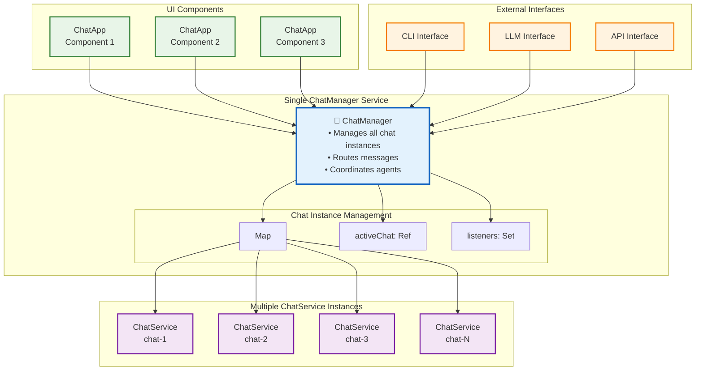

# ChatManager Architecture in EffectTalk

## Overview

The **ChatManager** is a single service that orchestrates multiple chat instances across the entire application. It follows the EffectTalk pattern of "Everything is a Service" while managing multiple concurrent chat sessions.

## Architecture Pattern



## Key Concepts

### **Single ChatManager Instance**
- One ChatManager service per application
- Manages a registry of ChatService instances
- Provides unified interface for all chat operations

### **Multiple ChatService Instances**
- Each chat app gets its own ChatService instance
- Each instance maintains its own state (messages, typing, agent)
- Instances are created on-demand and cleaned up when closed

### **Centralized Routing**
- All chat operations go through ChatManager
- ChatManager routes to appropriate ChatService instance
- Enables global operations (broadcast, active chat switching)

## Implementation Example

```typescript
export class ChatManager extends Effect.Service<ChatManagerApi>()(
  "ChatManager",
  {
    scoped: Effect.gen(function* () {
      // Central registry of chat instances
      const chatInstancesRef = yield* Ref.make<Map<string, ChatService>>(new Map());
      const activeChatRef = yield* Ref.make<string | null>(null);
      
      const sendMessage = (chatId: string, content: string) =>
        Effect.gen(function* () {
          // Get or create chat instance
          const chatService = yield* getChatInstance(chatId);
          // Route message to specific chat
          return yield* chatService.sendMessage(content);
        });
      
      const sendMessageToActiveChat = (content: string) =>
        Effect.gen(function* () {
          const activeChatId = yield* Ref.get(activeChatRef);
          if (!activeChatId) {
            return yield* Effect.fail(new ChatError({ message: "No active chat" }));
          }
          return yield* sendMessage(activeChatId, content);
        });
      
      return {
        sendMessage,
        sendMessageToActiveChat,
        setActiveChat: (chatId: string) => Ref.set(activeChatRef, chatId),
        getAllActiveChats: () => Effect.map(Ref.get(chatInstancesRef), map => Array.from(map.keys())),
        // ... other operations
      };
    }),
    dependencies: [ChatService.Default],
  }
) {}
```

## Universal Interface Access

### GUI Interface
```typescript
// React components use ChatManager
export function ChatApp({ config }: ChatAppProps) {
  const handleSendMessage = useCallback((text: string) => {
    const program = Effect.gen(function* () {
      const chatManager = yield* ChatManager;
      return yield* chatManager.sendMessage(config.id, text);
    });
    Effect.runPromise(Effect.provide(program, ChatManager.Default));
  }, [config.id]);
}
```

### CLI Interface
```bash
# CLI commands route through ChatManager
buddy chat send "Hello world"        # → sendMessageToActiveChat()
buddy chat send-to chat-2 "Hello"    # → sendMessage("chat-2", "Hello")
buddy chat switch chat-2             # → setActiveChat("chat-2")
buddy chat list                      # → getAllActiveChats()
```

### LLM Interface
```typescript
// Natural language processing
const processNaturalLanguage = (input: string) =>
  Effect.gen(function* () {
    const intent = yield* parseIntent(input);
    const chatManager = yield* ChatManager;
    
    switch (intent.action) {
      case 'send_message':
        if (intent.chatId) {
          return yield* chatManager.sendMessage(intent.chatId, intent.content);
        } else {
          return yield* chatManager.sendMessageToActiveChat(intent.content);
        }
      case 'switch_chat':
        return yield* chatManager.setActiveChat(intent.chatId);
    }
  });

// Examples:
// "Send a message to the writing chat" → sendMessage("writing-chat", content)
// "Send hello to active chat" → sendMessageToActiveChat("hello")
// "Switch to development chat" → setActiveChat("dev-chat")
```

## Benefits

### 1. **Centralized Control**
- Single point of truth for all chat operations
- Easy to implement global features (broadcast, chat switching)
- Consistent error handling and logging

### 2. **Resource Efficiency**
- Chat instances created only when needed
- Automatic cleanup when chats are closed
- Shared service dependencies

### 3. **Interface Flexibility**
- Same operations available via GUI, CLI, LLM
- Easy to add new interface types
- Consistent behavior across interfaces

### 4. **Scalability**
- Handles unlimited concurrent chats
- Each chat maintains independent state
- Easy to add chat-level features

### 5. **Testing & Debugging**
- Single service to mock for tests
- Centralized logging and monitoring
- Easy to inspect all active chats

## Migration Path

1. **Create ChatManager** alongside existing ChatService
2. **Update ChatApp components** to use ChatManager
3. **Add CLI interface** using ChatManager
4. **Add LLM interface** using ChatManager
5. **Optimize and enhance** with advanced features

This architecture provides the foundation for true "Everything is a Service" where any interface can control any chat operation through a single, well-defined service. 