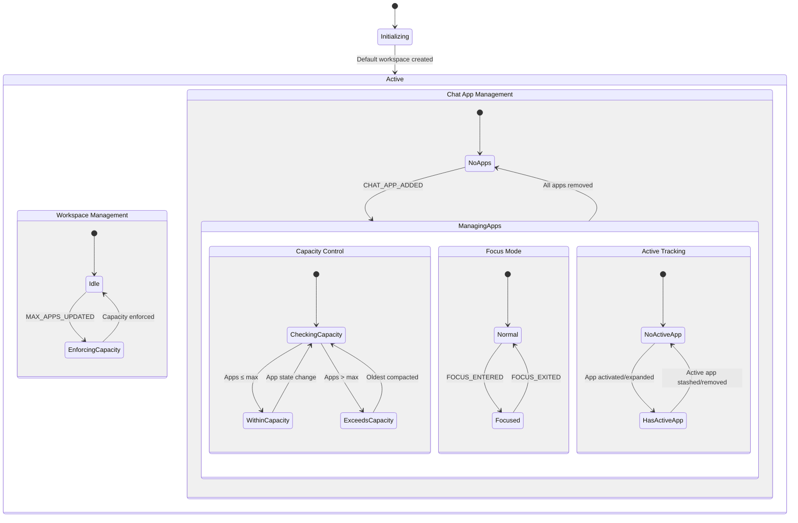

# Workspace State Machine - XState Format Documentation

This document provides a comprehensive XState-compatible state chart definition for the workspace management system, based on the test suite and implementation analysis.

## Overview

The workspace state machine manages:
- **Workspace Lifecycle**: Creation, activation, archiving
- **Chat App States**: Stashed, compact, expanded with capacity limits
- **Focus Mode**: Single app visibility with state restoration
- **Active App Tracking**: User input targeting
- **Capacity Management**: Automatic compacting of oldest apps

## Visual State Chart



## Complete XState Definition

```typescript
import { createMachine, assign } from 'xstate';

interface WorkspaceContext {
  currentWorkspaceId: string | null;
  workspaces: Record<string, WorkspaceEntry>;
  chatApps: Record<string, ChatAppEntry>;
  maxExpandedApps: number;
}

interface WorkspaceEntry {
  id: string;
  name: string;
  createdAt: Date;
  lastActiveAt: Date;
  isArchived: boolean;
  availableAgents: string[];
  color: string;
  description: string;
  icon: string;
  maxExpandedApps: number;
  activeAppId: string | null;
}

interface ChatAppEntry {
  id: string;
  workspaceId: string;
  status: 'stashed' | 'compact' | 'expanded';
  isArchived: boolean;
  lastActiveAt: Date;
  config: ChatAppConfig;
  previousStatus?: 'expanded' | 'compact'; // For focus mode restoration
}

const workspaceMachine = createMachine({
  id: 'workspace',
  initial: 'initializing',
  context: {
    currentWorkspaceId: null,
    workspaces: {},
    chatApps: {},
    maxExpandedApps: 2
  } as WorkspaceContext,
  
  states: {
    initializing: {
      entry: 'createDefaultWorkspace',
      always: {
        target: 'active',
        cond: 'hasDefaultWorkspace'
      }
    },
    
    active: {
      type: 'parallel',
      
      states: {
        // Workspace Management
        workspaceManagement: {
          initial: 'idle',
          states: {
            idle: {
              on: {
                WORKSPACE_ADDED: {
                  actions: 'addWorkspace'
                },
                WORKSPACE_UPDATED: {
                  actions: 'updateWorkspace'
                },
                WORKSPACE_ACTIVATED: {
                  actions: 'activateWorkspace'
                },
                WORKSPACE_ARCHIVED: {
                  actions: 'archiveWorkspace'
                },
                WORKSPACE_MAX_EXPANDED_APPS_UPDATED: {
                  actions: 'updateMaxExpandedApps',
                  target: 'enforcingCapacity'
                }
              }
            },
            
            enforcingCapacity: {
              entry: 'enforceMaxExpandedApps',
              always: 'idle'
            }
          }
        },
        
        // Chat App State Management
        chatAppManagement: {
          initial: 'noApps',
          
          states: {
            noApps: {
              on: {
                CHAT_APP_ADDED: {
                  target: 'managingApps',
                  actions: 'addChatApp'
                }
              }
            },
            
            managingApps: {
              type: 'parallel',
              
              on: {
                CHAT_APP_REMOVED: [
                  {
                    target: 'noApps',
                    cond: 'isLastApp',
                    actions: 'removeChatApp'
                  },
                  {
                    actions: 'removeChatApp'
                  }
                ]
              },
              
              states: {
                // Capacity Management
                capacityControl: {
                  initial: 'checkingCapacity',
                  
                  states: {
                    checkingCapacity: {
                      always: [
                        {
                          target: 'withinCapacity',
                          cond: 'isWithinCapacity'
                        },
                        {
                          target: 'exceedsCapacity'
                        }
                      ]
                    },
                    
                    withinCapacity: {
                      on: {
                        CHAT_APP_EXPANDED: {
                          target: 'checkingCapacity',
                          actions: 'expandChatApp'
                        },
                        CHAT_APP_COMPACTED: {
                          target: 'checkingCapacity',
                          actions: 'compactChatApp'
                        }
                      }
                    },
                    
                    exceedsCapacity: {
                      entry: 'compactOldestExpandedApp',
                      always: 'checkingCapacity'
                    }
                  }
                },
                
                // Focus Mode Management
                focusMode: {
                  initial: 'normal',
                  
                  states: {
                    normal: {
                      on: {
                        CHAT_APP_FOCUS_ENTERED: {
                          target: 'focused',
                          actions: 'enterFocusMode'
                        }
                      }
                    },
                    
                    focused: {
                      on: {
                        CHAT_APP_FOCUS_EXITED: {
                          target: 'normal',
                          actions: 'exitFocusMode'
                        }
                      }
                    }
                  }
                },
                
                // Active App Tracking
                activeAppTracking: {
                  initial: 'noActiveApp',
                  
                  states: {
                    noActiveApp: {
                      on: {
                        CHAT_APP_ACTIVATED: {
                          target: 'hasActiveApp',
                          actions: 'setActiveApp'
                        },
                        CHAT_APP_EXPANDED: {
                          target: 'hasActiveApp',
                          actions: 'setActiveAppOnExpand'
                        }
                      }
                    },
                    
                    hasActiveApp: {
                      on: {
                        CHAT_APP_ACTIVATED: {
                          actions: 'setActiveApp'
                        },
                        CHAT_APP_STASHED: [
                          {
                            target: 'noActiveApp',
                            cond: 'isActiveAppStashed',
                            actions: 'clearActiveApp'
                          }
                        ],
                        CHAT_APP_COMPACTED: {
                          actions: 'updateActiveAppOnCompact'
                        },
                        CHAT_APP_REMOVED: [
                          {
                            target: 'noActiveApp',
                            cond: 'isActiveAppRemoved',
                            actions: 'clearActiveApp'
                          }
                        ]
                      }
                    }
                  }
                }
              }
            }
          }
        }
      }
    }
  }
});
```

## Key Business Rules

### 1. Capacity Management
- **Default Limit**: 2 expanded apps per workspace
- **Enforcement**: Automatic compacting of oldest apps when limit exceeded
- **Chronological Sorting**: Uses `lastActiveAt` timestamps
- **Dynamic Limits**: Per-workspace `maxExpandedApps` configuration

### 2. Focus Mode
- **Single App Visibility**: Only focused app is expanded
- **State Preservation**: `previousStatus` stored for visible apps
- **Smart Restoration**: Only apps with `previousStatus` are restored
- **Isolation**: Stashed apps remain stashed during focus

### 3. Active App Tracking
- **Single Active**: Only one `activeAppId` per workspace
- **Auto-Assignment**: Expanding an app makes it active
- **Smart Cleanup**: Active app cleared when stashed/removed
- **Fallback Selection**: Next most recent expanded app becomes active

### 4. Workspace Isolation
- **Independent State**: Each workspace manages its own apps
- **Separate Limits**: Per-workspace capacity configuration
- **Context Switching**: Activating workspace doesn't affect app states

## Event Catalog

### Workspace Events
```typescript
// Workspace lifecycle
WORKSPACE_ADDED: { workspaceId: string, name: string, ... }
WORKSPACE_UPDATED: { workspaceId: string, updates: Partial<WorkspaceEntry> }
WORKSPACE_ACTIVATED: { workspaceId: string }
WORKSPACE_ARCHIVED: { workspaceId: string }
WORKSPACE_MAX_EXPANDED_APPS_UPDATED: { workspaceId: string, maxExpandedApps: number }
```

### Chat App Events
```typescript
// App lifecycle
CHAT_APP_ADDED: { appId: string, workspaceId: string, config: ChatAppConfig }
CHAT_APP_REMOVED: { appId: string }

// State transitions
CHAT_APP_EXPANDED: { appId: string }
CHAT_APP_COMPACTED: { appId: string }
CHAT_APP_STASHED: { appId: string }

// Special modes
CHAT_APP_FOCUS_ENTERED: { appId: string }
CHAT_APP_FOCUS_EXITED: { appId: string }
CHAT_APP_ACTIVATED: { appId: string }
```

## Integration Architecture

### LLM Bridge Integration
```typescript
// External event transformation
TAB_ADDED → WORKSPACE_ACTIVATED
CHAT_APP_ADDED (tabId) → CHAT_APP_ADDED (workspaceId)
CHAT_APP_EXPANDED (tabId) → CHAT_APP_EXPANDED (workspaceId)
CHAT_APP_CLOSED → CHAT_APP_REMOVED
```

### React Hook Integration
```typescript
// State access hooks
useCurrentWorkspace() → WorkspaceEntry | null
useActiveWorkspaceIds() → string[]
useWorkspaceStore(selector) → T

// Action hooks
useWorkspaceActions() → {
  createWorkspace, updateWorkspace, activateWorkspace,
  addChatApp, expandChatApp, compactChatApp, ...
}
```

### Test Coverage Matrix

| Feature | Unit Tests | Integration Tests | E2E Tests |
|---------|------------|-------------------|-----------|
| Capacity Management | ✅ (5 tests) | ✅ | ✅ |
| Focus Mode | ✅ (2 tests) | ✅ | ✅ |
| Active App Tracking | ✅ (5 tests) | ✅ | ✅ |
| Workspace Isolation | ✅ (2 tests) | ✅ | ✅ |
| LLM Bridge Events | ✅ (24 tests) | ✅ | ❌ |
| UI Components | ✅ | ✅ | ✅ |

**Total**: 49 tests with 100% pass rate

## State Persistence

### Snapshot Structure
```typescript
interface WorkspaceSnapshot {
  currentWorkspaceId: string | null;
  workspaces: Record<string, WorkspaceEntry>;
  chatApps: Record<string, ChatAppEntry>;
  version: string;
  timestamp: Date;
}
```

### Restoration Logic
1. **Validate Schema**: Ensure snapshot compatibility
2. **Migrate Data**: Handle version differences
3. **Restore State**: Apply snapshot to store
4. **Enforce Rules**: Run capacity management
5. **Update Timestamps**: Refresh `lastActiveAt` values

This comprehensive state chart documentation serves as the definitive reference for understanding, implementing, and maintaining the workspace state machine. 